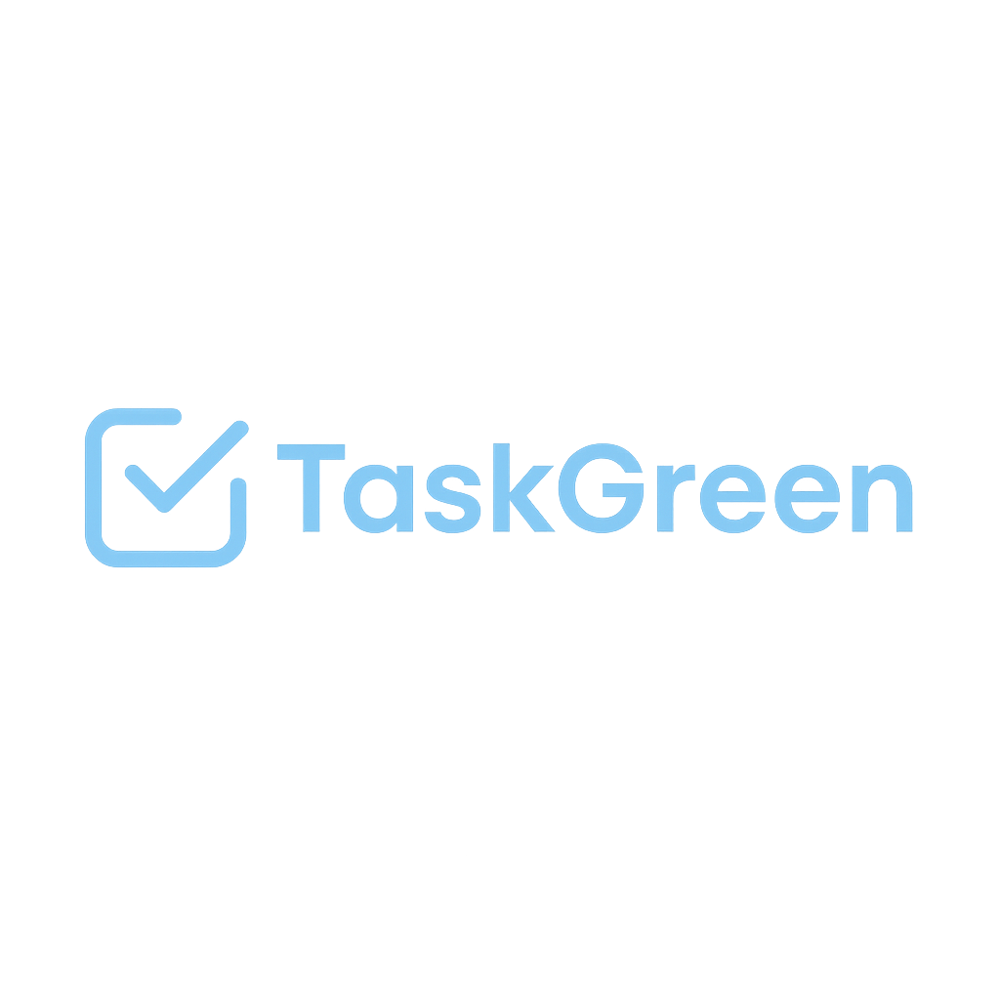

<!-- Imagem do logo (use URL absoluta ou mantenha o arquivo no mesmo diretório do README) -->

  

<h2>📑 Sumário</h2>

<ul>
  <li><a href="#💡-sobre-o-projeto">💡 Sobre o Projeto</a></li>
  <li><a href="#🚀-funcionalidades-principais">🚀 Funcionalidades Principais</a></li>
  <li><a href="#🎨-prototipagem">🎨 Prototipagem</a></li>
  <li><a href="#🖥️-tecnologias-utilizadas">🖥️ Tecnologias Utilizadas</a></li>
  <li><a href="#🗂️-estrutura-do-projeto">🗂️ Estrutura do Projeto</a></li>
  <li><a href="#📄-documentação-da-api">📄 Documentação da API</a></li>
  <li><a href="#🌐-deploy">🌐 Deploy</a></li>
  <li><a href="#🔧-como-rodar-localmente">🔧 Como rodar localmente</a></li>
  <li><a href="#🧑‍💻-equipe">🧑‍💻 Equipe</a></li>
  <li><a href="#🔗-contato">🔗 Contato</a></li>
  <li><a href="#✨-diferenciais-do-taskgreen">✨ Diferenciais do TaskGreen</a></li>
  <li><a href="#📝-licença">📝 Licença</a></li>
</ul>

<h2>💡 Sobre o Projeto</h2>

TaskGreen é um aplicativo mobile multiplataforma desenvolvido com <strong>React Native + Expo</strong>, integrado a uma <strong>API Java Spring Boot</strong> com <strong>MongoDB</strong>. Seu propósito é proporcionar uma ferramenta intuitiva e eficiente para <strong>gerenciar tarefas pessoais</strong>, ajudando os usuários a planejarem o dia a dia e organizar prioridades.

Com foco na simplicidade e produtividade, o app permite <strong>cadastrar</strong>, <strong>editar</strong>, <strong>pesquisar</strong>, <strong>visualizar</strong> e <strong>excluir</strong> tarefas com facilidade.

<h2>🚀 Funcionalidades Principais</h2>

<ul>
  <li>✅ Cadastro de tarefas com imagem.</li>
  <li>✅ Listagem de todas as tarefas.</li>
  <li>✅ Pesquisa rápida por palavras-chave.</li>
  <li>✅ Edição de tarefas cadastradas.</li>
  <li>✅ Exclusão de tarefas cadastradas.</li>
  <li>✅ Feedback visual sobre o status: concluído, expirado, pendente.</li>
  <li>✅ Integração em tempo real com a API.</li>
  <li>✅ Interface moderna e amigável.</li>
</ul>

<h2>🎨 Prototipagem</h2>

  O protótipo do TaskGreen foi desenvolvido de forma colaborativa por toda a equipe.

  

<h2>🖥️ Tecnologias Utilizadas</h2>

<h3>📱 Mobile</h3>

  

  Utilizamos <strong>React Native</strong> e <strong>React Navigation</strong> para estruturação das telas e navegação.  
  O <strong>Expo</strong> facilita a execução e testes da aplicação.  
  Para requisições HTTP, utilizamos a biblioteca <strong>Axios</strong>.

<h3>☕ API</h3>

  

  A API foi construída com <strong>Java</strong> e <strong>Spring Boot</strong> para estruturação RESTful, utilizando o <strong>MongoDB Atlas</strong> para persistência de dados.  
  Além disso, o <strong>Docker</strong> foi implementado para facilitar a conteinerização e deploy da aplicação.

<h2>🗂️ Estrutura do Projeto</h2>

<h3>📱 Mobile (taskgreen-mobile)</h3>

<pre>
📁 assets
 └── 📁 components
      ├── navbar.js                 # Componente de navegação principal do app
      └── 📁 screens
           ├── editar.js            # Tela para editar uma tarefa existente
           ├── home.js              # Tela principal que lista todas as tarefas
           ├── novatarefa.js        # Tela para criação de uma nova tarefa
           ├── pesquisa.js          # Tela de pesquisa de tarefas por palavra-chave
           ├── visualizar.js        # Tela para visualizar detalhes de uma tarefa
           └── icons/               # Ícones utilizados no app
                ├── +foto.png
                ├── concluido.png
                ├── expirado.png
                ├── home.png
                ├── tarefa.png
                └── Union.png
</pre>

<h3>☕ API (taskgreen-api)</h3>

<pre>
📁 src
 └── 📁 main
      ├── 📁 java
      │    └── 📁 com.taskgreen.apitarefas
      │         ├── 📁 config
      │         │    ├── CorsConfig               # Configurações de CORS
      │         │    └── MongoConfig              # Configuração da conexão com MongoDB
      │         ├── 📁 controller
      │         │    └── TarefaController         # Endpoints para manipulação das tarefas
      │         ├── 📁 dto
      │         │    ├── TarefaDTO                # Objeto de transferência de dados de tarefas
      │         │    └── TarefaMultipartDTO       # DTO para upload de arquivos
      │         ├── 📁 global
      │         │    └── GlobalExceptionHandler   # Manipulação global de exceções
      │         ├── 📁 model
      │         │    └── Tarefa                   # Modelo de dados da tarefa
      │         ├── 📁 repository
      │         │    └── TarefaRepository         # Interface para operações com banco de dados
      │         ├── 📁 service
      │         │    └── TarefaService            # Lógica de negócio para manipulação de tarefas
      │         └── ApiTarefasApplication         # Classe principal de inicialização da API
      └── 📁 resources
           └── application.properties             # Arquivo de configuração da aplicação

📄 Dockerfile                                     # Arquivo de configuração para conteinerização da aplicação
(caminho: taskgreen-api/Dockerfile)
</pre>

<h2>📄 Documentação da API</h2>

  🔍 <strong>Interface Swagger UI:</strong> 
  👉 <a href="https://taskgreen.onrender.com/swagger-ui/index.html">https://taskgreen.onrender.com/swagger-ui/index.html</a> 
  Esta é a interface bonitona, interativa, onde dá para testar os endpoints direto no navegador.

  📄 <strong>JSON da documentação OpenAPI:</strong> 
  👉 <a href="https://taskgreen.onrender.com/api-task-docs">https://taskgreen.onrender.com/api-task-docs</a> 
  Esse é o raw JSON que descreve todos os endpoints da API. Serve para integrar com ferramentas externas ou gerar clientes de API automaticamente.

<h2>🌐 Deploy</h2>

  O projeto está hospedado e disponível online: 
  🔗 <a href="https://taskgreen.onrender.com/api/tarefas">https://taskgreen.onrender.com/api/tarefas</a>

<h2>🔧 Como rodar localmente</h2>

<h3>🛠️ Pré-requisitos</h3>
<ul>
  <li>Node.js</li>
  <li>Expo CLI</li>
  <li>Java 17+</li>
  <li>MongoDB Atlas com IP liberado</li>
  <li>IDEs: VSCode (frontend), IntelliJ (backend)</li>
</ul>

<h3>☕ Back-End</h3>

<pre>
# Clone o repositório e acesse o diretório
git clone https://github.com/seuusuario/taskgreen-api.git
cd taskgreen-api

# Configure o application.properties com as credenciais do MongoDB

# Execute a aplicação (Spring Boot)
./mvnw spring-boot:run
</pre>

<h3>📱 Front-End</h3>

<pre>
# Clone o repositório e acesse o diretório
git clone https://github.com/seuusuario/taskgreen-mobile.git
cd taskgreen-mobile

# Instale o Expo CLI globalmente (caso ainda não tenha)
npm install -g expo-cli

# Instale as dependências do projeto
npm install

# Instale o React Navigation
npm install @react-navigation/native

# Instale as dependências nativas do React Navigation
npx expo install react-native-screens react-native-safe-area-context react-native-gesture-handler react-native-reanimated

# Inicie o projeto
npx expo start --tunnel
</pre>

Abra o <strong>Expo Go</strong> no celular e escaneie o QR code gerado!

<h2>🧑‍💻 Equipe</h2>

<table>
  <tr>
    <th>Nome</th>
    <th>Função</th>
  </tr>
  <tr>
    <td>Felipe Rottner Rodrigues</td>
    <td>Back-end</td>
  </tr>
  <tr>
    <td>Sabrina Ambrosia da Silva</td>
    <td>Back-end & Banco de Dados</td>
  </tr>
  <tr>
    <td>Vitor Aldivan Silva Lima</td>
    <td>Front-end & Ligação entre front e back</td>
  </tr>
  <tr>
    <td>Estella Beatriz Gutemberg Vilarouca De Sousa</td>
    <td>Front-end</td>
  </tr>
</table>

<h2>🔗 Contato</h2>

<table>
  <tr>
    <th>Integrante</th>
    <th>LinkedIn</th>
  </tr>
  <tr>
    <td>Felipe Rottner Rodrigues</td>
    <td><a href="https://www.linkedin.com/in/felipe-rottner-rodrigues-b13625319">Felipe no LinkedIn</a></td>
  </tr>
  <tr>
    <td>Sabrina Ambrosia da Silva</td>
    <td><a href="https://www.linkedin.com/in/sabrina-silva-723291333">Sabrina no LinkedIn</a></td>
  </tr>
  <tr>
    <td>Vitor Aldivan Silva Lima</td>
    <td><a href="https://www.linkedin.com/in/vitoraldivan">Vitor no LinkedIn</a></td>
  </tr>
  <tr>
    <td>Estella Beatriz Gutemberg Vilarouca De Sousa</td>
    <td><a href="https://www.linkedin.com/in/estella-vilarouca-13aa6b368?utm_source=share&utm_campaign=share_via&utm_content=profile&utm_medium=android_app">Estella no LinkedIn</a></td>
  </tr>
</table>

<h2>✨ Diferenciais do TaskGreen</h2>

<ul>
  <li>✅ Código limpo e modular</li>
  <li>✅ Estrutura robusta para escalabilidade</li>
  <li>✅ API bem documentada</li>
  <li>✅ Design colaborativo</li>
  <li>✅ Experiência mobile fluida</li>
</ul>

<h2>📝 Licença</h2>

Distribuído sob licença <strong>MIT</strong>. 
Veja o arquivo <code>LICENSE</code> para mais informações.

